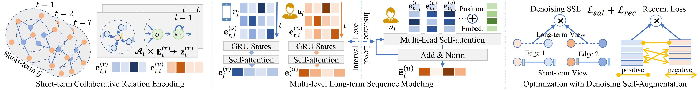

# SelfGNN: Self-Supervised Graph Neural Networks for Sequential Recommendation

This is the Tensorflow implementation by <a href='https://github.com/LIU-YUXI'>@LIU-YUXI</a> for SelfGNN model proposed in this paper:

> **Self-Supervised Graph Neural Networks for Sequential Recommendation**  
> Yuxi Liu, Lianghao Xia, Chao Huang\* 
> *SIGIR2024*

\* denotes corresponding author

<p align="center">

</p>

In this paper, we propose a novel framework called Self-Supervised Graph Neural Network (**SelfGNN**) for sequential recommendation. The **SelfGNN** framework encodes short-term graphs based on time intervals and utilizes Graph Neural Networks (GNNs) to learn short-term collaborative relationships. It captures long-term user and item representations at multiple granularity levels through interval fusion and instance modeling. Importantly, our personalized self-augmented learning structure enhances model robustness by mitigating noise in short-term graphs based on long-term user interests and personal stability. 

## 📝 Environment

You can run the following command to download the codes faster:

```bash
git clone https://github.com/HKUDS/SA-GNN.git
```

Then run the following commands to create a conda environment:

```bash
conda create -y -n sagnn python=3.6.12
conda activate sagnn
pip install matplotlib==3.5.1
pip install numpy==1.21.5
pip install scipy==1.7.3
pip install tensorflow_gpu==1.14.0
```

## 📚 Recommendation Dataset

We utilized four public datasets to evaluate: *Gowalla, MovieLens,Yelp* and *Amazon*. Following the common settings of implicit feedback, if user  has rated item , then the element  is set as 1, otherwise 0. We filtered out users and items with too few interactions.

We employ the most recent interaction as the test set, the penultimate interaction as the validation set, and the remaining interactions in the user behavior sequence as the training data.

The datasets are in the `./Dataset` folder:

```
- ./Dataset/amazon(yelp/movielens/gowalla)
|--- sequence    # user behavior sequences (List)
|--- test_dict    # test item for each users (Dict)
|--- trn_mat_time    # user-item graphs in different periods (sparse matrix)
|--- tst_int    # users to be test (List)
```

### Original Data

The original data of our dataset can be found from following links (thanks to their work):

- Yelp: https://www.yelp.com/dataset
- Amazon-book: https://cseweb.ucsd.edu/~jmcauley/datasets/amazon/links.html
- Gowalla: [SNAP: Network datasets: Gowalla (stanford.edu)](https://snap.stanford.edu/data/loc-Gowalla.html)
- Movielens: [MovieLens 10M Dataset | GroupLens](https://grouplens.org/datasets/movielens/10m/)

### Methods for preprocessing original data

If you want to process your data into the several data files required for SA-GNN (i.e., `sequence`,`test_dict`,`trn_mat_time`,`tst_int`), you can refer to the following code for preprocessing the raw data of Amazon-book:

1. Download the original data file (for example, `amazon_ratings_Books.csv` from links for original datasets) and run [preprocess_to_trnmat.ipynb](./preprocess_to_trnmat.ipynb) to get the `trn_mat_time` and `tst_int` files, as well as other intermediate files (`train.csv`,`test.csv`).
2. Run [preprocess_to_sequece.ipynb](./preprocess_to_sequence.ipynb), which reads in the intermediate files (`train.csv` and `test.csv`) and finally generates the `sequence` and `test_dict` files.

You are welcome to modify the preprocessing code as needed to suit your data.

## 🚀 Examples to run the codes

You need to create the `./History/` and the `./Models/` directories. The command to train SA-GNN on the Gowalla/MovieLens/Amazon/Yelp dataset is as follows.

- Gowalla

```
./gowalla.sh > ./gowalla.log 
```

- MovieLens

```
./movielens.sh > ./movielens.log 
```

- Amazon

```
./amazon.sh > ./amazon.log 
```

- Yelp

```
./yelp.sh > ./yelp.log
```

## 🌟 Citation

If you find this work is helpful to your research, please consider citing our paper:

```bibtex
coming soon
```

**Thanks for your interest in our work!**
